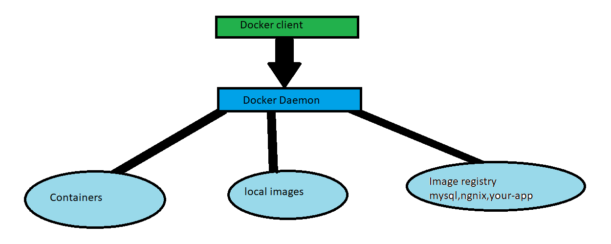

# Dev-ops

## Docker

### Docker commands

```shell
docker --version
docker run -p 5000:5000 in28min/hello-world-python:0.0.1.RELEASE
docker run -p 5000:5000 in28min/hello-world-java:0.0.1.RELEASE
docker run -p 5000:5000 in28min/hello-world-nodejs:0.0.1.RELEASE
docker run -d -p 5000:5000 in28min/hello-world-nodejs:0.0.1.RELEASE
docker run -d -p 5001:5000 in28min/hello-world-python:0.0.1.RELEASE
docker logs 04e52ff9270f5810eefe1f77222852dc1461c22440d4ecd6228b5c38f09d838e
docker logs c2ba
docker images
docker container ls
docker container ls -a
docker container stop f708b7ee1a8b
docker run -d -p 5001:8080 in28min/hello-world-rest-api:0.0.1.RELEASE
docker pull mysql
docker search mysql
docker image history in28min/hello-world-java:0.0.1.RELEASE
docker image history 100229ba687e
docker image inspect 100229ba687e
docker image remove mysql
docker image remove in28min/hello-world-java:0.0.1.RELEASE
docker container rm 3e657ae9bd16
docker container ls -a
docker container pause 832
docker container unpause 832
docker container stop 832
docker container inspect ff521fa58db3
docker container prune
docker system
docker system df
docker system info
docker system prune -a
docker top 9009722eac4d
docker stats 9009722eac4d
docker container run -p 5000:5000 -d -m 512m in28min/hello-world-java:0.0.1.RELEASE
docker container run -p 5000:5000 -d -m 512m --cpu-quota=50000  in28min/hello-world-java:0.0.1.RELEASE
docker system events
 
docker container stats 4faca1ea914e3e4587d1d790948ec6cb8fa34f26e900c12632fd64d4722fd59a
docker stats 42f170966ce613d2a16d7404495af7b3295e01aeb9142e1fa1762bbdc581f502
 
cd /in28Minutes/git/devops-master-class/projects/hello-world/hello-world-python 
docker build -t in28min/hello-world-python:0.0.2.RELEASE . 
docker run -p 5000:5000 -d in28min/hello-world-python:0.0.2.RELEASE
docker history e66dc383f7a0
docker push in28min/hello-world-python:0.0.2.RELEASE
 
cd ../hello-world-nodejs/
docker build -t in28min/hello-world-nodejs:0.0.2.RELEASE . 
docker container run -d -p 5000:5000 in28min/hello-world-nodejs:0.0.2.RELEASE
docker push in28min/hello-world-nodejs:0.0.2.RELEASE
 
cd ../hello-world-java/
docker build -t in28min/hello-world-java:0.0.2.RELEASE . 
docker run -d -p 5000:5000 in28min/hello-world-java:0.0.2.RELEASE
docker push in28min/hello-world-java:0.0.2.RELEASE
 
docker run -d -p 5001:5000 in28min/hello-world-nodejs:0.0.3.RELEASE ping google.com
 
 
docker run -d -p 8000:8000 --name=currency-exchange in28min/currency-exchange:0.0.1-RELEASE
docker run -d -p 8100:8100 --name=currency-conversion in28min/currency-conversion:0.0.1-RELEASE
 
docker network ls
docker network inspect bridge
 
docker run -d -p 8100:8100 --env CURRENCY_EXCHANGE_SERVICE_HOST=http://currency-exchange --name=currency-conversion --link currency-exchange in28min/currency-conversion:0.0.1-RELEASE
 
docker network create currency-network
docker container stop currency-exchange
docker container stop currency-conversion
docker run -d -p 8000:8000 --name=currency-exchange --network=currency-network in28min/currency-exchange:0.0.1-RELEASE
docker run -d -p 8100:8100 --env CURRENCY_EXCHANGE_SERVICE_HOST=http://currency-exchange --name=currency-conversion --network=currency-network in28min/currency-conversion:0.0.1-RELEASE
 
docker-compose --version
cd ../../microservices/
docker-compose up
docker-compose up -d
docker container ls
docker network ls
docker network inspect microservices_currency-compose-network
docker-compose down
docker container ls -a
docker system prune -a
docker-compose config
docker-compose images
docker-compose ps
docker-compose top

```

### Docker detached mode(-d) and Logs

some time back we ran the container like so 

> docker run -p 5000:5000 in28min/hello-world-nodejs:0.0.1.RELEASE
> 
it runs fine but here , our container is tied up with the terminal;<br>which means if we will close the 
terminal then the container will shut down as well .

what we can do is add a tag called **"-d"** to the command above .

> docker run -d -p 5000:5000 in28min/hello-world-nodejs:0.0.1.RELEASE
> 
to show the logs of a container 

> docker logs container-id
> 
lets say you want to follow the logs; then add **-f** to it .<br>
-f stand for follow .

> docker logs -f container-id
> 

### Docker images and containers

docker images : <br>this command will give you list of images .<br>

docker container ls : <br>this shows all the running containers <br>

docker container ls -a : <br>this will display all the containers irrespective of its status .<br>

docker container stop <container-id>: <br>used to stop the container <br>


### Docker client and Docker engine 



#### Docker client:

we can say that the docker uses the client-server architecture .<br>
Docker client is the client and the Docker server is the server . <br>

so when we run a "docker run " command , the docker client sends it to the daemon .
Docker daemon is responsible for executing that specific command .


                  
### Docker image

docker pull mysql : it will pull the image from the docker registry .

images are built with number of layers .

to see the layers you can use : docker image history imageid

To look at the details behind each images : docker image inspect imageid

To remove a docker imaged : docker image remove image-id

### Docker Container

to pause the running container : docker container pause container-id

to unpause a container : docker container unpause container-id

to stop a container : docker container stop container-id

to kill a container:

>  **Diffrernce between kill and stop command**
> 
> The stop command will wait for the application to close all the connections before shutting down .
> 
> The kill command won't wait , it will shut down everything right away .

docker container inspect container-id : this will give you more details about the container

docker container prune : This will delete all unused containers 

### Learning Docker commands : Docker system and Docker stat

#### docker system

```shell
  df          Show docker disk usage
  events      Get real time events from the server
  info        Display system-wide information
  prune       Remove unused data
  
  -- now try to run the df command
  
λ docker system df
TYPE            TOTAL     ACTIVE    SIZE      RECLAIMABLE
Images          5         0         1.026GB   1.026GB (100%)
Containers      0         0         0B        0B
Local Volumes   0         0         0B        0B
Build Cache     21        0         30.09MB   30.09MB

λ docker system prune
WARNING! This will remove:
  - all stopped containers
  - all networks not used by at least one container
  - all dangling images
  - all dangling build cache

Are you sure you want to continue? [y/N] y


```

docker system prune -a : will remove all images and containers that are not in running stages .

#### stats

docker stats container-id : the stats about the specific container .

to make sure a container uses upto a certain amount of memory use the below

> docker run -d -p 5000:5000 **-m 512** in28min/hello-world-java:0.0.1.RELEASE

we can also control how much CPU we want to give to a container as well .

> docker run -d -p 5000:5000 -m 512 --cpu-quota=50000 in28min/hello-world-java:0.0.1.RELEASE
> 


 


