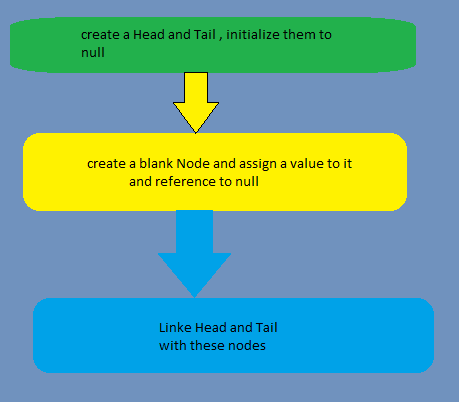

# LinkedList
## What is a Linkedlist
linked list is a collection of nodes where each node has the **data** 
and a pointer to the next node .

> The very first node in a linked list is called as the **head**
> 
> The vary last node of the linkedlist is called as the **tail**
> 
<P>In an array all the elements are contiguous(side by side) where as in 
Linked list the elements are scattered but the pointers help to keep the order in place .</P>

> Linkedlist is created in the heap
### How to create a linked list 

well there are 3 steps 


> Write a program to create a singly linked list 
> 
```java
public class Node {
    public int data;
    public Node next;
}

public class SingleLinkedList{
    Node head;
    Node tail;
    int size;

    Node makeSingleLinkeList(int val){
        Node singleNode = new Node();
        singleNode.data = val;
        singleNode.next = null;
        head = singleNode;
        tail = singleNode;
        size = 1;
        return singleNode;
    }
}

public class Main {
    public static void main(String[] args) {
        SingleLinkedList sl = new SingleLinkedList();
        sl.makeSingleLinkeList(10);
        System.out.println("The value in the linked list is :"+sl.head.data);

    }
}


```
### Insertion method in a single linked list

```java
package linkedlist2;

public class LinkedList2 {
  public Node2 head;
  public Node2 tail;
  public int size;

  public Node2 createSingleLinkedList(int data) {
    Node2 newNode = new Node2(data);
    head = newNode;
    tail = newNode;
    size = 1;
    return head;

  }

  public void inserIntoLinkedList(int val, int location) {
    Node2 node = new Node2(val);
    if (head == null) {
      createSingleLinkedList(val);
      return;
    } else if (location == 0) { // beginning of the linked list
      node.next = head;
      head = node;
    } else if (location >= size) { // at the end of the linkedlist
      tail.next = node;
      node.next = null;
      tail = node;
    } else { // in between
      Node2 tempNode = head; // start iterating through each node starting from head
      int index = 0;
      while(index < location -1){
        tempNode = tempNode.next;
        index ++;
      }
      Node2 nextNode = tempNode.next;
      tempNode.next = node;
      node.next  = nextNode;
    }
    size ++;
  }

  public void displayLInkedListValue() {
    if (head != null) {
      System.out.println("Singly linked list value is :" + head.data);
    }
  }
}


import linkedlist2.*;

public class Main {
    public static void main(String[] args) {
        LinkedList2 linkedList2 = new LinkedList2();
        linkedList2.createSingleLinkedList(10);
        System.out.println("The value of head is "+linkedList2.head.data);
        System.out.println("_______________________________");
        System.out.println("Add a new head");
        linkedList2.inserIntoLinkedList(20, 0);
        System.out.println("The value of head is "+linkedList2.head.data);
        System.out.println("The value of tail is "+linkedList2.tail.data);
        System.out.println("The size is "+linkedList2.size);
        System.out.println("_______________________________");
        System.out.println("Add a new tail");
        linkedList2.inserIntoLinkedList(30, 3);
        System.out.println("The value of head is "+linkedList2.head.data);
        System.out.println("The value of tail is "+linkedList2.tail.data);
        System.out.println("The size is "+linkedList2.size);
    }
}

/**
 * output
 * The value of head is 10
 _______________________________
 Add a new head
 The value of head is 20
 The value of tail is 10
 The size is 2
 _______________________________
 Add a new tail
 The value of head is 20
 The value of tail is 30
 The size is 3
 */

```
## how to define a node?

To define a node, we need two things .
1. data
2. pointer to the next node

the data type of the pointer is **"NODE"**

## Structure of a node

```java
class Node{
    int data;
    Node next;
    
    public Node(int data){
        this.data = data;
        this.next= null;
    }
}

```
## How to create a node ?

To create a node we first need a pointer .

1. Write a program to create a Linkedlist with 3 nodes

```java
//Node creation
package com.practice.linkedlist;

class LinkedList{
    Node head;//the very first node is the head
    static class Node{
        int data;
        Node next;

        Node(int data){
            this.data = data;
            this.next = null;
        }

    }
}

public class NodeCreation {

    public static void main(String[] args) {
        LinkedList lList = new LinkedList();
        lList.head = new LinkedList.Node(1);
        LinkedList.Node second = new LinkedList.Node(2);
        LinkedList.Node third = new LinkedList.Node(3);
        // all the nodes are made but they are not linked
        // now lets link those
        // link the head to the second node
        lList.head.next = second;
        //link the second node to the third
        second.next = third;


    }
}

```

now that the nodes are created and linked as well, now we need to traverse through 
those nodes and display them on the screen .

```java
package com.practice.linkedlist;

class AnotherLinkedList{
    Node2 head;
    static class Node2{
        int data;
        Node2 pointer;

        Node2(int data){
            this.data = data;
            this.pointer = null;
        }
    }

    public  void traverseAndDisplay(){
        Node2 headNode = head;
        if(headNode == null){
            System.out.println("list is empty");
        }
        while (headNode != null){
            System.out.print(" "+headNode.data);
            headNode = headNode.pointer;
        }
    }
}

public class NodeTraversal {
    public static void main(String[] args) {
        AnotherLinkedList lList = new AnotherLinkedList();
        lList.head = new AnotherLinkedList.Node2(1);
        AnotherLinkedList.Node2 two = new AnotherLinkedList.Node2(2);
        AnotherLinkedList.Node2 three = new AnotherLinkedList.Node2(3);
        lList.head.pointer = two;
        two.pointer = three;
        lList.traverseAndDisplay();

    }
}

// output
// 1 2 3

```
## Linked List insertion

we can insert node in a linked list in 3 positions
1. at the front (make it head)
2. at the end (make it tail)
3. after a certain node

adding element to the beginning of the linked list is quicker .
adding element to the end of the linked list is more time consuming .

### At the front of the linked list

```java
package com.practice.linkedlist;

class LinkedList3{
    Node3 head;
    static  class Node3{
        int data;
        Node3 pointer;

        Node3(int data){
            this.data = data;
            this.pointer = null;
        }
    }
    // to display list
    public  void displayValues(){
        Node3 val = head;
        if (val == null){
            System.out.println("empty linked list");
        }else{
            while(val != null){
                System.out.println(" "+val.data);
                val = val.pointer;
            }
        }
    }
    public void pushToHead(int data){
        Node3 newHeadNode = new Node3(data);
        newHeadNode.pointer = head;
        head = newHeadNode;
    }

}
public class LinkedListInsertionHead {
    public static void main(String[] args) {
        LinkedList3 linkedList3 = new LinkedList3();
        linkedList3.head = new LinkedList3.Node3(10);
        LinkedList3.Node3 second = new LinkedList3.Node3(15);
        LinkedList3.Node3 third = new LinkedList3.Node3(20);

        //head pointer to point to second
        linkedList3.head.pointer = second;
        second.pointer = third;

        // display
        System.out.println("before insertion the values are ");
        linkedList3.displayValues();

        // insert to head
        System.out.println("after insertion the values are ");
        linkedList3.pushToHead(12);
        linkedList3.displayValues();

    }
}

//output:

/*
before insertion the values are 
 10
 15
 20
after insertion the values are 
 12
 10
 15
 20     
        
 */
```

## inserting element at the end of the linkedlist

```java
//inside the linkedlist class
class Linkedlist {
    public void insertAfterANode(Node4 prev_node, int val) {
        Node4 newNode = new Node4(val);
        if (prev_node != null) {
            newNode.pointer = prev_node.pointer;
            prev_node.pointer = newNode;
        }
    }
}
// output
/*
  before insertion the values are 
10 
15 
20 
after insertion the values are 
12 
10 
15 
20 
after insertion in the middle the values are :
12 
10 
15 
32 
20       
 */
    
```
## Traversal of the linked list
```
public void displayLInkedListValue() {
    if (head != null) {
      Node2 tempNode = head;
      for (int i=0; i<size; i++){
        System.out.print(tempNode.data+" ");
        tempNode = tempNode.next;
      }
    }
  }

```

# LinkedList deletion


